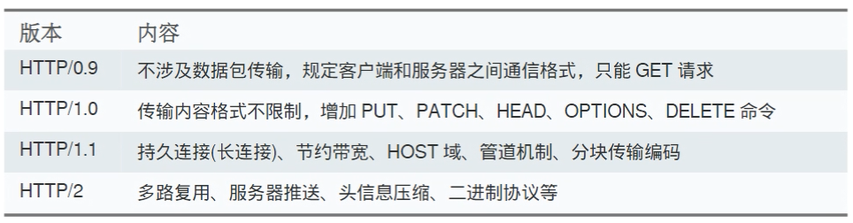
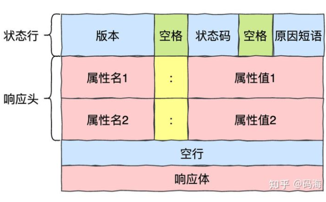
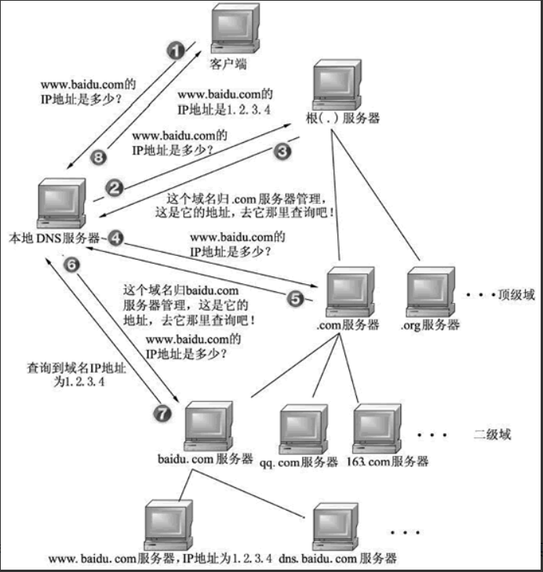

# HTTP

- Hyper Text Transfer Protocol,  超文本传输协议，基于 TCP 协议传输,  默认端口号80
- 定义了一种通讯报文的格式
- 版本发展
  - 0.9
  - 1.0：每个tcp连接只能发一个请求 ，然后就断开连接，为了避免这个问题，加了个非标准字段`Connection： keep-alive`实现
  - 1.1：引入持久连接，tcp连接可以被多个请求复用，不用加非标字段Connection； 管道机制，一个tcp连接可以同时支撑多个请求；缺点是一个tcp被复用后，每次只能处理一个请求，如果某个请求响应耗时长，后面的请求就会被阻塞（队头阻塞） 
  - 2：head+body都是二进制格式；复用tcp可以不按照顺序响应，避免阻塞； 压缩头部数据并使用索引号代替相同的头部数据；




## HTTP格式  

- 请求

  

  - 方法：GET、POST、PUT
  - URI: Uniform Resource Identifier 统一资源标识符, 可以唯一定位互联网上的资源
  - URL: uniform resource locator， 统一资源定位符,URL 其实是 URI 的一种子集，区别就是URI 定义资源，而 URL 不单定义这个资源，还定义了如何找到这个资源。
    - http://www.aspxfans.com:8080/news/index.asp?boardID=5&ID=24618&page=1#name
      协议部分://域名部分:端口/文件目录/文件名?参数xx=xxx & 参数yy=yyy #锚点
      

- ###### 响应：



- 状态码：
  - 1xx信息，服务器收到请求，需要请求者继续执行操作
  - 2xx成功，操作被成功接收并处理
    - 200
  - 3xx重定向，需要进一步的操作以完成请求
  - 4xx客户端错误，请求包含语法错误或无法完成请求
    - 400
    - 401
    - 403
    - 404 
  - 5xx服务器错误，服务器在处理请求的过程中发生了错误
    - 500 
    - 502
- 一个http报文到物理层数据包：http数据 + http头 + tcp头 + ip头 + mac头

参考

- [一个HTTP打趴80%面试者](https://mp.weixin.qq.com/s/DY4-yV_QXTGUB5_lvAn3LQ)


## HTTPS加密

- HTTPS = HTTP + SSL/TLS
  - SSL(secure socket layer)， 安全套接字层
  - TLS(Transport Layer Security)，传输层安全， TLS替换SSL，目前使用TLS1.1和TLS1.2
- SSL/TLS安全原理：非对称传输秘钥，hash验证秘钥完整性，秘钥对称加密报文
- HTTPS默认端口443，需要SSL证书（向CA申请）

### 传输方式

- 明文传输
- 对称加密传输：线下将秘钥交付给对方 可保证传输安全
- 非对称加密：公钥和私钥； 公钥加密私钥解密，或者 私钥加密公钥解密； 怎么把公钥安全的传递给对方？   
  - 服务器将公钥按照明文方式发布给客户端，其他人也可以拿到公钥; 窃听？

- 非对称加密优化：两组公钥私钥，客户端和服务端各一组
  - 服务端->客户端：服务端用客户端的公钥加密，客户端用客户端的私钥解密
  - 客户端->服务端：客户端用服务端的公钥加密，服务端用服务端的私钥解密
  - 问题：
    - 每次用非对称加密效率低

- 非对称+对称优化

  - 服务端将公钥传递给客户端，客户端产生一个对称加密的秘钥，将秘钥用服务端的公钥加密后传递给服务端，服务端用私钥解密后得到客户端产生的对称加密秘钥。

  - 问题：
    - 中间人攻击

- 中间人攻击
  - 非对称+对称：或者两组非对称加密场景
    - 服务端需要传递公钥给客户端（明文）， 这里出现一个中间人，将公钥截取，然后中间人自己创建一个非对称秘钥，将中间人的公钥传递给客户端。
    - 客户端产生对称秘钥用中间人的公钥加密后，传递给客户端的过程中，中间人截取用自己的私钥解密，然后再用服务端的公钥加密后传递给服务端。
    - 这样造成客户端和服务端有一个或者n个中间人，但是客户端和服务端并不知道，并且数据泄露。
  - 怎样保证客户端和服务端中间没有中间人呢？ 找一个公认的安全机构：CA机构
- CA机构
  - CA机构颁发数字证书。
  - 数字证书：
    - 网站在使用HTTPS前，需要向CA机构申领一份数字证书，数字证书里含有证书持有者信息、公钥信息等；服务端首先将数字证书传递给客户端。
    - 证书本身的传输过程中，如何防止被篡改？ -- 数字签名
    - 数字签名：在数字证书内
      - CA机构在颁发数字证书的时候，也会生成对应的数字签名； 这个签名是根据数字证书的明文进行hash，然后将hash值用CA自己的私钥进行加密产生数字签名；
      - 客户端收到数字签名后用CA的公钥（每个客户端都保存了CA的公钥，这个CA公钥的安全是基于操作系统的根证书为起点，层层信任）解密，得到数字证书进过hash后的值。
      - 当数字证书在中间过程被别人修改了，客户端收到后，将证书进行hash，得到的hash值就会和数字签名通过CA公钥解密后的值不一致, 因此可以判断数字证书被篡改。
      - **数字签名**是CA用自己的私钥加密**数字证书**明文经过hash后的值。保证数字证书的安全。数字证书安全，则里面的公钥也可以安全，就不存在中间人攻击。用数字证书里的公钥加密自己的对称秘钥，此后可以安全的进行数据交互。
  - 中间人有自己的数字证书
    - 服务端在传递数字证书的过程中，中间人截取，用CA公钥解密后得到服务器的公钥； 然后传递中间人的数字证书给客户端，客户端解密后得到中间人的公钥；
      - 服务端—>客户端：中间人用服务端公钥解密，然后修改，然后用自己私钥加密，传递给客户端，客户端用中间人的公钥解密，得到被修改后的内容  
      - 客户端->服务端：客户端用中间人公钥加密，传递被中间人截取，中间人用私钥解密并修改内容后，用服务端的公钥加密并传递给服务端，服务端用私钥解密得到被修改的内容。
    - 数字证书中有证书持有者信息，客户端在收到后，可以验证这个数字证书是否是自己想要交互的服务器
      - 数字证书包含：**公钥**、公钥拥有者名称、CA的**数字签名**、有效期、授权中心名称、证书序列号等信息
        - 身份认证：在网络中传递信息的双方互相不能见面，利用数字证书可确认双方身份，而不是他人冒充的。
        - 保密性：通过使用数字证书对信息加密，只有接收方才能阅读加密的信息，从而保证信息不会被他人窃取。
        - 完整性：利用数字证书+数字签名可以校验传送的信息在传递的过程中是否被篡改过或丢失。
        - 防抵赖：利用数字证书进行数字签名，可准确标示签名人身份及验证签名内容，因此签名人对签名及签名内容具有不可否认性，其作用与手写签名具有同样的法律效力

    - 证书本身合法性：
      - 信任：浏览器内置了信任的根证书，就是看看web服务器的证书是不是这些信任根发的或者信任根的二级证书机构颁发的。
      - 合法持有者：简单来说证明对方是否持有证书的对应私钥。验证方法两种，一种是对方签个名，我用证书验证签名；另外一种是用证书做个信封，看对方是否能解开。
  - 窃听：非对称加密过程中，服务端给客户端发消息，用服务端自己的私钥加密，其他人可以用服务端公开的公钥进行解密，从而窃听到服务端对客户端的信息
  - 篡改：知道了信息加密的秘钥， 在对称加密中，中间人知道了秘钥，可以对消息实现篡改

  - 总结下：https防止中间人攻击，解决怎么安全的将对称秘钥传递给对方，解决方法是用非对称秘钥，怎么安全的将非对称秘钥公钥传递给对方，解决方法是CA认证机构，将CA认证机构私钥加密本端公钥后的数据传递给对方，对方用CA公钥解密后得到对端的公钥。然后用公钥加密对称秘钥传递给对端，两端就可以用对称秘钥交互了。

参考

- [探究！一个数据包在网络中的心路历程](https://mp.weixin.qq.com/s/iSZp41SRmh5b2bXIvzemIw)
- [一个故事讲完https](https://mp.weixin.qq.com/s?__biz=MzAxOTc0NzExNg==&mid=2665513779&idx=1&sn=a1de58690ad4f95111e013254a026ca2)


## 常见问题：

- 在浏览器键入网址，到网页显示，发生了什么?

  - 解析 URL，生成http请求
  - DNS解析查询IP
  - socket -- TCP链接
  - IP层传递（路由器）  -- ICMP(错误和控制信息) / ARP(IP和MAC的映射)

  https://mp.weixin.qq.com/s/iSZp41SRmh5b2bXIvzemIw


# DNS

## 1. 基本概念

- DNS：Domain Name System， 域名（解析）系统

- 主要作用是提供域名和ip之间可查询的映射关系;  网络通讯大部分是基于TCP/IP的，而TCP/IP是基于IP地址;

- DNS是应用层协议, 所有DNS请求和回答报文使用的UDP数据报经过端口53发送， 使用`CS`模型提供服务

- DNS服务使用分布式的层次数据库模式以及缓存方法来解决单点集中式的问题。

- 简写字母含义

  ```shell
  （1）A：地址记录（Address），返回域名指向的IP地址
  （2）NS：域名服务器记录（Name Server），返回保存下一级域名信息的服务器地址。该记录只能设置为域名，不能设置为IP地址
  （3）MX：邮件记录（Mail eXchange），返回接收电子邮件的服务器地址
  （4）CNAME：规范名称记录（Canonical Name），返回另一个域名，即当前查询的域名是另一个域名的跳转； 
  	当前这个域名是用户使用，转到真实域名后解析ip使用;
  （5）PTR：逆向查询记录（Pointer Record），只用于从IP地址查询域名
  ```

## 2. 域名层级

`host.sld.tld.root  -- www.baidu.com.root`、

- host: 主机名/三级域名，用户自定义分配

- sld：`second level domain`， 次级域名，用户购买自定义注册

- tld：`top level domain`，顶级域名，目前有一千多个，由托管商管理，分为

  - 一般性顶级域名如`.com, .cn, .edu`等 
  - 国别顶级域名如`.cn, .jp`等
  - 普通顶级域名gTLD如`.top, .work, .club`等

- root：根域名，目前有13个根域名，分别由托管商托管；通常省略不写；

  - 根域的DNS服务器信息保存在互联网中所有的DNS服务器中。任何DNS服务器就都可以找到并访问根域DNS服务器。

    

域名的层级是按照上面这么划分的，每级域名长度不超过63个字符，不区分大小写，只能使用`数字`、`字母`和`-`，一个完整的域名不超过255个字符。

## 3. 域名解析过程



- 解析步骤（非图片解释）：

1. 检查浏览器DNS缓存
2. 检查操作系统DNS缓存
3. 查询本机host文件
4. 客户端向本地DNS服务器发起解析请求，本地DNS服务器查询缓存，没有进行下一步
5. 本地DNS服务器向根服务器发起查询请求，请求顶级域DNS服务器地址； 根DNS服务器返回顶级域DNS服务器地址
6. 本地DNS服务器向顶级域DNS服务器发起查询请求，顶级DNS服务器返回次级DNS服务器地址
7. 本地DNS服务器向次级域DNS服务器发起查询请求， 次级DNS服务器查询本地缓存，返回给本地DNS服务器要查询的ip
8. 本地DNS服务器向客户端回响应，携带查询到的ip地址


- 参考：[https://www.cnblogs.com/amunote/p/16326118.html](https://www.cnblogs.com/amunote/p/16326118.html)


## 4. 协议实现

- BIND（Berkeley Internet Name Domain，伯克利因特网名称域）服务是全球范围内使用最广泛、最安全可靠且高效的域名解析服务程序

- bind配置参数

  ```shell
  主配置文件（/etc/named.conf）：
  	只有58行，而且在去除注释信息和空行之后，实际有效的参数仅有30行左右，这些参数用来定义bind服务程序的运行。
  	
  区域配置文件（/etc/named.rfc1912.zones）：
  	用来保存域名和IP地址对应关系的所在位置。
  	类似于图书的目录，对应着每个域和相应IP地址所在的具体位置，当需要查看或修改时，可根据这个位置找到相关文件。
  	
  数据配置文件目录（/var/named）：
  	该目录用来保存域名和IP地址真实对应关系的数据配置文件。
  ```

- 在Linux系统中，bind服务程序的名称为named。

- named-checkconf命令和named-checkzone命令，分别检查主配置文件与数据配置文件中语法或参数的错误。

-  bind程序配置主从

- bind程序配置加密传输

- 部署DNS缓存服务器

## 5. 常见问题

- 使用`dig +trace 域名` 可以得到解析过程


---


## 域名解析过程

以www.server.com为例

- 客户端首先会发出一个DNS请求，问www.server.com的IP是啥，并发给本地DNS服务器（也就是客户端的 TCP/IP 设置中填写的DNS服务器地址）。
    - 在向本地DNS发起DNS查询之前，是否还会从本地机器的hosts文件中查看？ -- 会先查看本地host和缓存
- 本地域名服务器**收到客户端的请求后，如果缓存里的表格能找到www.server.com，则它直接返回IP地址。如果没有，本地DNS会去问它的**根域名服务器：“老大， 能告诉我www.server.com的IP地址吗？根域名服务器是最高层次的，它**不直接用于域名解析，但能指明一条道路**。
- 根DNS收到来自本地DNS的请求后，发现后置是.com，说：“www.server.com这个域名归.com区域管理”，我给你.com **顶级域名服务器**地址给你，你去问问它吧。
- 本地DNS收到顶级域名服务器的地址后，发起请求问“老二，你能告诉我 www.server.com的IP地址吗？”顶级域名服务器说：“我给你负责www.server.com**区域的权威DNS服务器**的地址，你去问它应该能问到”。
- 本地 DNS 于是转向问权威DNS服务器：“老三，www.server.com对应的IP是啥呀？”server.com的权威DNS服务器，它是域名解析结果的原出处。为啥叫权威呢？就是我的域名我做主。
- 权威DNS服务器查询后将对应的IP地址 X.X.X.X 告诉本地DNS。
- 本地DNS再将IP地址返回客户端，客户端和目标建立连接。

---


## bind

- BIND（berkeley Internet name domain）是DNS（domain name system）协议的一种实现，BIND软件中包括DNS Server（进程名named），用来将主机名解析成ip地址；


- DNS协议运行在UDP协议之上，使用端口号UDP 53号端口作为数据通信端口(域名解析)，使用TCP53号端口实现数据同步(主从同步)。

绝大多数DNS服务器,都是靠Bind提供服务的


- DNS在应用层，根据域名找IP；ARP在网络层，根据IP找MAC