三次握手和四次挥手的【细节】，注意我说的是**细节**，比如 CLOSE_WAIT 和 TIME_WAIT 状态

bilibili 问了这样一个问题，你可以感受一下：A 与 B 建立了正常连接后，从未相互发过数据，这个时候 B 突然机器重启，问 A 此时的 tcp 状态处于什么状态？如何消除服务器程序中的这个状态

[万得](https://www.zhihu.com/search?q=万得&search_source=Entity&hybrid_search_source=Entity&hybrid_search_extra={"sourceType"%3A"answer"%2C"sourceId"%3A341999235})问过流量拥塞和控制机制、腾讯问过tcp和ip包头常见有哪些字段

东方财富网问了阻塞和非阻塞 socket 在 send、recv 函数上的行为表现，异步 connect 函数的写法，select 函数的用法，epoll 与 select 的区别

通信协议如何设计避免粘包；http 协议的 get 和 post 方法的区别 

问的比较深的会让你画出 http 协议的格式


# 一、TCP

## 1. 概括

- **面向连接**：三次握手，四次挥手
- **流传输**：按照字节流传输，没有分界线

- **可靠传输**：校验和，确认序号，重传机制
- **流量控制**：根据接收端滑动窗口控制发送端的发送窗口
- **拥塞控制**：发送端根据网络质量等因素控制发送速度：TODO 补充原因

## 2. TCP格式

- **20字节TCP首部** + 40个最大选项 + 上层数据

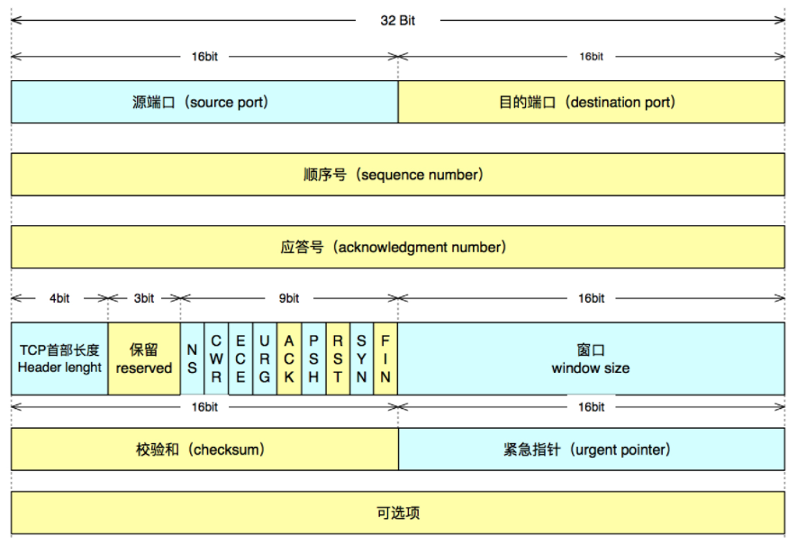

### 字段含义解释

- 方向：**源端口(16) + 目的端口(16)**， 端口级别，分别为16bit，2字节
- **序号 & 确认号**：分别为32bit，4字节
- tcp首部长度/保留字段/控制字段：共2字节（4bit+3bit+9bit）
  - 首部长度4bit，最大表示15，每个单位表示4个字节，因此最大表示60个字节；其中tcp首部固定20个字节，可选项最多40个字节
- 窗口：16bit，2字节
- 校验和：16bit，2字节； 发送端填充，接受端校验，校验包括头部和数据
- 紧急指针：16bit，2字节；紧急指针是**发送端向接收端发送紧急数据**的方法；紧急指针是一个正的偏移量，和序号字段的值相加表示最后一个紧急数据的下一字节的序号；
  - 什么时候使用？
- 可选项（40个字节）
  - sack：重传机制用，接收方的ACK消息携带，将接收方缓存的已收到的组信息发送给发送方，使得发送发只发送丢掉的数据包。


### 缩写名词

- MTU：`maximum transmission unit`，每个数据链路层能够确定发送的一个帧的最大长度称为最大传输单元
  - 通常不包括MAC头的长度为 1500 字节，包含MAC头的长度是1518
- MSS：`Maximum Segment Size`， 除去 IP 和 TCP 头部之后，一个网络包所能容纳的**TCP 数据的最大长度**。 
  - 避免过长，在IP层被分片，在TCP建立链接时双方协商MSS

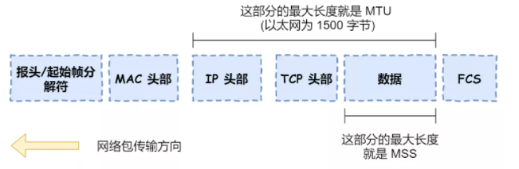

- SYN：`Synchronize Sequence Numbers` 三次握手中的前两次携带数据
- ISN：`Initial Sequence Number`（初始序列号）, 在三次握手的过程当中，双方会用过SYN报文来交换彼此的 ISN。
  - ISN 并不是一个固定的值，而是每 4 ms 加一，溢出则回到 0
- ACK：`Acknowledgment number` 确认号, 用来告知对方下一个期望接收的序列号
- PSH：即 Push, 告知对方这些数据包收到后应该马上交给上层的应用，不能缓存
- RTT：`Round-Trip Time`，往返时间
- RTO：`Retransmission Timeout` 超时重传时间，超时重传时间 RTO 的值应该略大于报文往返 RTT 的值。（有专门的公式计算）


## 3. 三次握手

### 三条消息

- clinet->server：发送SYN， clinet状态变成syn_send
- server->client：接收并响应ACK + SYN， server端状态为syn_recv， clinet收到消息后connect返回，变成established
- client->server：响应ACK， server接收到响应后accept返回，变成established

### 状态转换

- client：close->**syn_sent**->established
- server：close->listen-**>syn_rcvd**->established


- 客户端 connect 成功返回是在第二次握手，服务端 accept 成功返回是在三次握手成功之后。

### TCP Fast Open （TFO）

首次三次握手后，生成cookie；下次建立连接的时候，直接用cookie+http请求，服务器验证后直接回复http响应，加速tcp建立


### 常见问题

- 为什么是三次握手

  - 三次确保双方都有发送和接受的能力

- 第三次握手为什么可以携带数据?

  -  第三次握手时，客户端已经处于established状态，并且已经知道服务端具有接受和发送的能力。

- 半链接队列和全连接队列指的是啥？  

  - syn队列和accpect队列
  - 服务端的状态从CLOSED变为LISTEN, 同时在内部创建了两个队列：syn队列和accpect队列
  - 服务端收到客户端的syn，这是服务端状态由listen->syn_rcvd，并将连接加入到syn队列，并回复客户端syn+ack
  - 服务端收到客户端ack，服务端将syn队列里的链接移动到accept队列，状态变为established，服务器的aceept函数调用时会取出accpet队列中的链接。

  

### 参考

- [硬不硬你说了算！近 40 张图解被问千百遍的 TCP 三次握手和四次挥手面试题](https://mp.weixin.qq.com/s?__biz=MzUxODAzNDg4NQ==&mid=2247484005&idx=1&sn=cb07ee1c891a7bdd0af3859543190202&)
- https://mp.weixin.qq.com/s?__biz=MzUxODAzNDg4NQ==&mid=2247484005&idx=1&sn=cb07ee1c891a7bdd0af3859543190202&


## 4. 四次挥手

### 四条消息

- client->server：FIN, 消息发出后，进入FIN_WAIT1状态
- server->client ：ACK，server发出响应后，进入closed_wait状态； client收到后进入FIN_WAIT2状态等待server的FIN
- server->clinet：FIN， server发出后进入last_ack状态，client收到后进入TIME_WAIT状态
- client->server：ACK， clinet进入time_wait状态，server收到ack后进入CLOSE状态


- 主动关闭链接的，进入`time_wait`状态


### 常见问题

- 为什么是四次挥手而不是三次？ (将第二次的ACK和第三次FIN合并)
  - 因为服务端在接收到FIN, 往往不会立即返回FIN, 必须等到服务端所有的报文都发送完毕了，才能发FIN;  所以会先回复ack，防止客户端重复发送FIN；
  - 三次的话可能因为服务端还有数据导致客户端的FIN超时引起重发。

### 三次握手和四次挥手的状态转换图

- 三次握手、四次挥手、状态转换图
  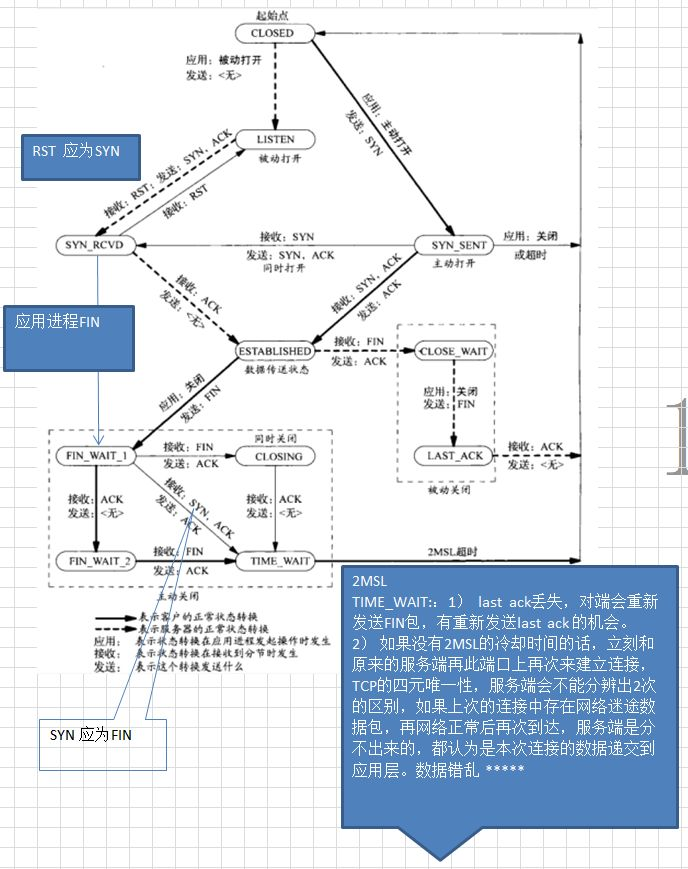
  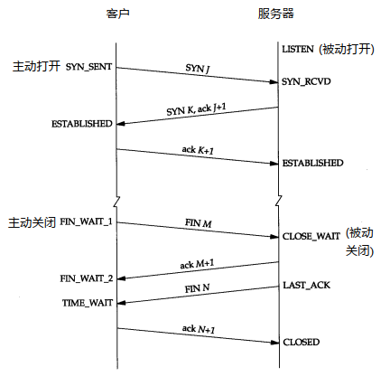
  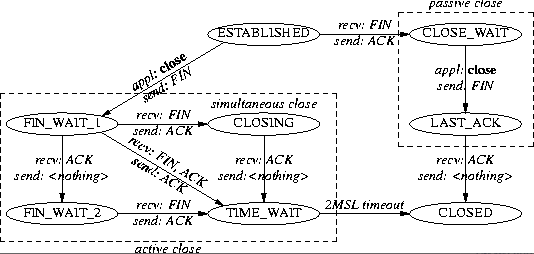


- 参考
  - [TCP网络编程中connect()、listen()和accept()三者之间的关系](https://zhuanlan.zhihu.com/p/142812172)

## 5. 重传/滑动窗口/流量控制/拥塞控制

### 5.1 重传

- 通过**序列号**与**确认应答**实现

#### 5.1.1 超时重传

- 超过指定的时间后，没有收到对方的 ACK 确认应答报文，就会重发该数据； 以时间为驱动
- 发生在数据包丢失或者应答包丢失
- 超时时间
  - RTT（`Round-Trip-Time` 往返时延）：因为网络质量时常变化，因此RTT是个变化值
  - RTO （`Retransmission Timeout` 超时重传时间）：超时重传时间 RTO 的值应该略大于报文往返  RTT 的值。（有专门的公式计算）
- 每当遇到一次超时重传的时候，都会将下一次超时时间间隔设为先前值的两倍。

#### 5.1.2 快速重传

- 解决超时重传，在重传失败时，要延迟2倍重传的慢速重传问题； 络状况真的不好的情况，超时重传没问题，但是如果网络状况好的时候，只是恰巧丢包了，那等这么长时间就没必要。
  - 解决网络情况好的丢包情况，快速重传
  - 快速重传（Fast Retransmit）机制，它不以时间为驱动，而是**以数据驱动重传。当收到三个相同的 ACK 报文时，会在定时器过期之前，重传丢失的报文段**
    - 收到相同ACK，说明前面某个ACK一直没被收到，确认机制是累计确认

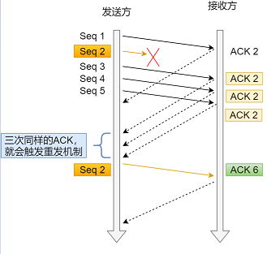

- 问题：重传的时候，是重传之前的一个，还是重传所有的问题？ SACK & D-SACK

##### **SACK**：

-  `Selective Acknowledgment` 选择性确认

- 在 TCP 头部「选项」字段里加一个 SACK 的东西，它可以将缓存的已收到的组信息发送给发送方，使得发送发只发送丢掉的数据包。  -- 接收方的ACK消息携带
- 如果要支持 SACK，必须双方都要支持。在 Linux 下，可以通过`net.ipv4.tcp_sack`参数打开这个功能；
- SACK允许选项只能出现在SYN段： 通信双发在SYN段或SYN+ACK段中添加SACK允许选项通知对端本端是否支持SACK，如果双发都支持，那么后续连接态通信过程中就可以使用SACK选项了。
  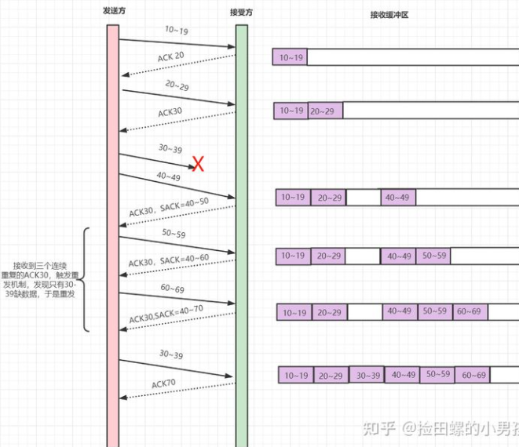

##### **D-SACK** ？

- Duplicate SACK，使用了 SACK 来告诉「发送方」有哪些数据被重复接收了。让发送方知道是应答报文丢了，可以不用传已接收的数据. 
  - 是收到因为网络延迟等原因而后到的数据包

- 因为网络延迟原因，有些延迟报文会被当成丢失报文，让接收方通过SACK告诉发送方。还是会导致有些报文重复接收问题。于是发送方通过SACK可以判断出哪些报文重复传输了，进而**调整自己的RTO或拥塞控制**。
- 在 Linux 下可以通过`net.ipv4.tcp_dsack`参数开启/关闭这个功能（Linux 2.4 后默认打开）。
  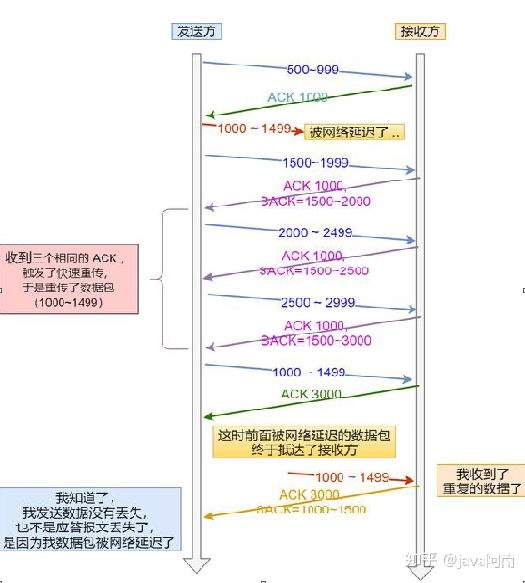

- 参考
  [30张图解： TCP 重传、滑动窗口、流量控制、拥塞控制发愁](https://zhuanlan.zhihu.com/p/133307545)


### 5.2 滑动窗口

- **窗口大小**就是指无需等待确认应答，而可以继续发送数据的最大值。
- 发送方窗口：发送方主机在等到确认应答返回之前，必须在缓冲区中保留已发送的数据。
  - 如果按期收到确认应答，此时数据就可以从缓存区清除。否则重传时有数据可用。
- 接收方窗口：避免「发送方」的数据填满「接收方」的缓存。 
  - 在某个时刻，接收方窗口可能会大于发送方窗口。
- **累计确认**就是接受方回复消息时，“ACK序号x”表示序号x以前的数据都已经接收到了，即使序号x以前的确认号丢失也没关系。x是个累计值
- 窗口在tcp的窗口字段表示：接收端告诉发送端自己还有多少缓冲区可以接收数据。
  - 通常窗口的大小是**由接收方的决定的**
  - 发送端可以根据这个接收端的处理能力来发送数据，而不会导致接收端处理不过来
- **发送方滑动窗口**：
  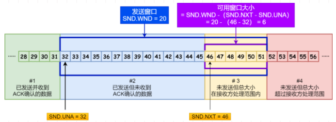
    - `SND.WND`：表示发送窗口的大小（大小是**由接收方指定的**）；
    - `SND.UNA`：是一个绝对指针，它指向的是已发送但未收到确认的第一个字节的序列号，也就是 #2 的第一个字节。
    - `SND.NXT`：也是一个绝对指针，它指向未发送但可发送范围的第一个字节的序列号，也就是 #3 的第一个字节。
- **接收方的滑动窗口**：
  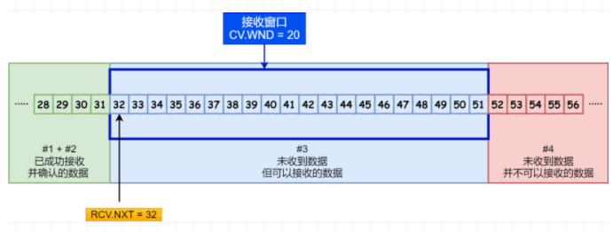
  - 分为三个部分：
    - 已成功接收并确认的数据（等待应用进程读取）
    - 未收到数据但可以接收的数据
    - 未收到数据并不可以接收的数据
  - `RCV.WND`：表示接收窗口的大小，它会通**告给发送方**。
  - `RCV.NXT`：是一个指针，它指向期望从发送方发送来的下一个数据字节的序列号，也就是 #3 的第一个字节。
- 接收窗口和发送窗口的大小并不是完全相等，接收窗口的大小是约等于发送窗口的大小的。  
  - 比如，当接收方的应用进程读取数据的速度非常快的话，这样的话接收窗口可以很快的就空缺出来。那么新的接收窗口大小，是通过 TCP 报文中的 Windows 字段来告诉发送方。那么这个传输过程是存在时延的，所以接收窗口和发送窗口是约等于的关系。? 接收了但是未被程序读取也会影响接收窗口的大小
- 当发送方可用窗口变为 0 时，发送方实际上会定时发送**窗口探测报文**，以便知道接收方的窗口是否发生了改变

- 总结：
  - tcp原理是一收一答，效率太低，窗口机制让发送方可以发送窗口内的数据而不需要等待响应，提高信息交互效率
  - 发送窗口四部分：已发送已收到ack，已发送未收到ack，可以发送但还未发送，不可以发送且未发送（缓冲区大于窗口）
  - 接受窗口三部分：已收到已回ack，未收到但可以接受的数据（没有已收到未回ack的数据），未收到不再窗口范围内的数据（缓冲区大于窗口）

### 5.3 流量控制

- 根据接收端的接收窗口调整发送速率，防止接收端缓存溢出； 一种机制可以让发送端根据接收端的实际接收能力控制发送的数据量

- TCP **利用滑动窗口实现流量控制**，**控制本端发送速率**对对端接受速率的影响
- 当接收方应用层程序没有读取已经接受的分组，而发送发一直在发送，或者说发送方速度大于接收方，会导致接收方返回的应答包里的win字段为0，表示接收方窗口满。这个时候有两种做法
  - 一是接收方在应用程序取走数据后，主动发一条消息给发送方，告知窗口有空闲数据可用，但是，如果这条消息丢了，会造成两边死锁
  - 二是当发送方接受到响应包了win为0时，就启动一个定时器，周期向接收方询问窗口信息 - **窗口探测(Window probe) 报文**
    - 窗口探查探测的次数一般为3次，每次次大约30-60秒（不同的实现可能会不一样）。如果3次过后接收窗口还是0的话，有的TCP实现就会发**`RST`报文来中断连接**。 
- 避免因缓存减小造成的丢包：**TCP 规定是不允许同时减少缓存又收缩窗口的，而是采用先收缩窗口，过段时间在减少缓存，这样就可以避免了丢包情况。**
- 糊涂窗口综合症
  - 当接受方速度小于发送方，每次接受方处理了几个字节，就通知发送方继续发送，导致发送方每次发送的有效内容只有几个字节。
  - 解决方法：
    - 让接收方不告知发送方**小窗信息**（小窗就不告诉发送方了）， 当**窗口大小小于min(MSS，缓存空间/2)** ，也就是小于MSS与1/2缓存大小中的最小值时，就会向发送方通告窗口为0，也就阻止了发送方再发数据过来。 - 至少大于MSS
    - 让发送方不发小数据，使用**`Nagle`算法**，该算法的思路是延时处理，它满足以下两个条件中的一条才可以发送数据：一是要等到**窗口大小>=MSS或是数据大小>=MSS**； 二是**收到之前发送数据的ack回包**；
      - `Nagle算法`默认是打开的, 如果*对于一些需要小数据包交互的场景的程序，比如，telnet或ssh这样的交互性比较强的程序，则需要关闭Nagle算*法。
      - `setsockopt(sock_fd, IPPROTO_TCP, TCP_NODELAY, (char *)&value, sizeof(int));`
    - MSS：`Maximum Segment Size`， 除去 IP 和 TCP 头部之后，一个网络包所能容纳的 TCP 数据的最大长度。 
      - 避免过长，在IP层被分片，在TCP建立链接时双方协商MSS


###  5.4 拥塞控制

- 根据网络状态，调整拥塞窗口，控制进入网络的速率，避免造成网络拥堵。 它的目标主要是最大化利用网络上瓶颈链路的带宽

- 应对网络质量变化的处理方法，避免发送方的数据填满整个网络； **控制发送端对网络的影响**
- 在网络出现拥堵时，如果继续发送大量数据包，可能会导致数据包时延、丢失等，这时TCP就会重传数据，但是一重传就会导致网络的负担更重，于是会导致更大的延迟以及更多的丢包，这个情况就会进入恶性循环被不断地放大
- **拥塞窗口cwnd** ： 是***发送方维护的一个的状态变量，它会根据网络的拥塞程度动态变化的。***
  - (发送窗口swnd、接收窗口rwnd) => `swnd = min(cwnd, rwnd)` **发送窗口=min(拥塞窗口，接受窗口)**
- 只要发送方**没有在规定时间内接收到ACK应答报文**，也就是发生了超时重传，就会认为网络出现了网络拥塞。
- 拥塞控制方法：

#### 5.4.1 **慢启动:指数增长**

- 当发送方每收到一个ACK，就拥塞窗口cwnd的大小就会加1。为指数型增长，直到涨到**慢启动门限ssthresh**，进入**拥塞避免算法**
  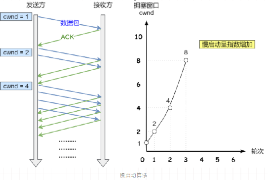

#### 5.4.2 **拥塞避免：逐一增长**

- 当拥塞窗口cwnd超过慢启动门限ssthresh就会进入拥塞避免算法。一般来说ssthresh的大小是65535字节。
- 每当收到一个ACK时，cwnd增加1/cwnd
  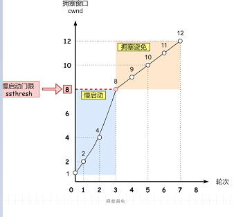
- 一直增长着后，网络就会**慢慢进入了拥塞的状况了，于是就会出现丢包现象**，这时就需要对丢失的数据包进行重传。当触发了重传机制，也就进入了**拥塞发生算法**。

#### 5.4.3 **拥塞发生：**

- 减少ssthresh、cwnd

- 拥塞发生时，会出现超时重传和快速重传情况
  - 发生超时重传说明网络已经比较拥堵了，使用**慢启动恢复**
  - 出现快速重传，说明连续收到了三次响应，则说明网络质量并不是特别糟糕，此时使用**快速恢复**。

##### 5.4.3.1 慢启动 ssthresh = cwnd/2, cwnd=1

- **门限降低ssthresh = cwnd/2, cwnd=1，**重新开始慢启动
  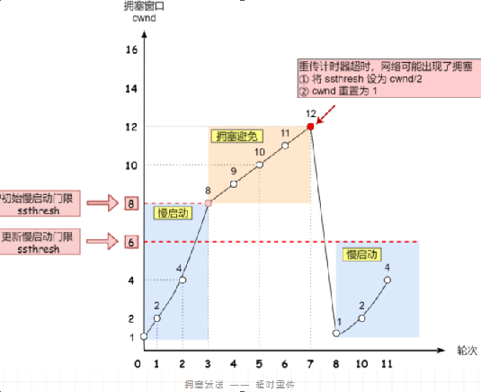

##### 5.4.3.2 **快速恢复**

- **门限降低为ssthresh=cwnd/2, cwnd=ssthresh+3快速恢复**


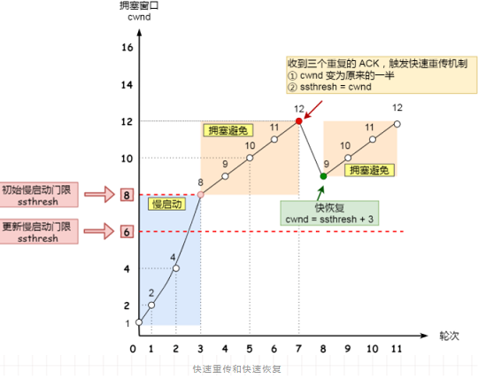

### 延迟确认

- 短时间内收到两个包，接收方将两个包的ack合并成一个回复
- TCP 要求这个延迟的时延必须小于500ms，一般操作系统实现都不会超过200ms。
- 有一些场景是不能延迟确认的，收到了就要马上回复:
  - 接收到了大于一个 frame 的报文，且需要调整窗口大小
  - TCP 处于 quickack 模式（通过tcp_in_quickack_mode设置）
  - 发现了乱序包

​	


#### 参考 

- [你还在为 TCP 重传、滑动窗口、流量控制、拥塞控制发愁吗？看完图解就不愁了](https://mp.weixin.qq.com/s?__biz=MzUxODAzNDg4NQ==&mid=2247484017&idx=1&sn=dc54d43bfd5dc088e48adcfa2e2bc13f)
- [万字长文 | 23 个问题 TCP 疑难杂症全解析](https://www.nowcoder.com/discuss/643068?from=zhnkw)


## 6. Tcp粘包 - Nagle算法

- TCP是面向流，没有界限的一串数据，TCP底层并不了解上层业务数据的具体含义，它会根据TCP缓冲区的实际情况进行包的划分
- 在业务上认为，一个完整的包可能会被TCP拆分成多个包进行发送，也有可能把多个小的包封装成一个大的数据包发送
  
- 发送端为了将多个发往接收端的包，更加高效的的发给接收端，于是采用了优化算法（`Nagle算法`），将多次间隔较小、数据量较小的数据，合并成一个数据量大的数据块，然后进行封包。那么这样一来，接收端就必须使用高效科学的拆包机制来分辨这些数据。
- TCP接收到数据包时，并不会马上交到应用层进行处理，或者说应用层并不会立即处理。实际上，TCP将接收到的数据包保存在接收缓存里，然后应用程序主动从缓存读取收到的分组。这样一来，如果TCP接收数据包到缓存的速度大于应用程序从缓存中读取数据包的速度，多个包就会被缓存，应用程序就有可能读取到多个首尾相接粘到一起的包。
- 其实tcp本身是**流式协议**，没有包的概念，说tcp粘包指的是tcp的上层应用层，多次调用了send函数，发送端将多次短消息合并成一起发送到接收端（也可能没有合并，因为就是流式的递送到对方的buf中）
- 总结粘包产生
  - 发送的数据小于TCP发送缓冲区的大小，TCP将多次写入缓冲区的数据一次发送出去，会发生粘包；Nagle算法开启，默认开启
  - 接收数据端的应用层没有及时读取接收缓冲区中的数据，将发生粘包

- 总结拆包产生
  - 要发送的数据大于TCP发送缓冲区剩余空间大小，将会发生拆包
  - 待发送数据大于MSS（最大报文长度），TCP在传输前将进行拆包

- **解决方法：**
  - 一是可以在发送的时候**设置消息头尾标记**，取的时候根据标记取，
  - 二是发送端按照**消息头+消息体**的格式，**消息头固定长度**，里面包含消息体的length，先固定长度解析消息头，然后再变长解析消息体。
  - 每个数据包封装为固定长度（一般不可取）
- [什么是TCP粘包？怎么解决这个问题](https://blog.csdn.net/weixin_41047704/article/details/85340311)


## 7. 选项

### 7.1 tcp keepAlive保活探测机制

```cpp
int keepalive = 1; // 开启keepalive属性
int keepidle = 60; // 如该连接在60秒内没有任何数据往来,则进行探测
int keepinterval = 5; // 探测时发包的时间间隔为5 秒
int keepcount = 3; // 探测尝试的次数.如果第1次探测包就收到响应了,则后2次的不再发.
setsockopt(rs, SOL_SOCKET, SO_KEEPALIVE, (void *)&keepalive , sizeof(keepalive ));
setsockopt(rs, SOL_TCP, TCP_KEEPIDLE, (void*)&keepidle , sizeof(keepidle ));
setsockopt(rs, SOL_TCP, TCP_KEEPINTVL, (void *)&keepinterval , sizeof(keepinterval ));
setsockopt(rs, SOL_TCP, TCP_KEEPCNT, (void *)&keepcount , sizeof(keepcount ));
```

- 背景
  - Tcp连接任意一方意外崩溃、当机、网线断开或路由器故障，另一方无法得知TCP连接已经失效。那么连接的另一方会一直维护这个连接。
  - 而作为“服务端”来说，长时间的积累会导致非常多的**半打开连接**，造成端系统资源的消耗和浪费，且有可能导致在一个无效的数据链路层面发送业务数据，结果就是发送失败。
  - 所以各端要做到**快速感知失败，减少无效链接操作**，这就有了TCP的**KeepAlive保活探测机制**。
- keepAlive机制原理
  - 一个保活机制，打开这个机制，当一个TCP连接建立之后，启用`TCP Keepalive`的一端便会启动一个计时器
  - （tcp最后一次交流后空闲开始）当这个计时器数值到达0之后（也就是经过**tcp_keep-alive_time**时间后），一个**TCP探测包**便会被发出。
  - 这个TCP探测包是一个纯ACK包（RFC1122#TCP Keep-Alives规范建议：不应该包含任何数据，但也可以包含1个无意义的字节，比如0x0），其**Seq号与上一个包是重复的**，所以其实探测保活报文不在窗口控制范围内。
  - 处理
    
    详细解释一下就是：
    - 1）对方主机**接受正常**，并回复正常响应；服务器在两小时后将保活定时器复位。
    - 2）客户主机**已经崩溃**，并且关闭或者正在重新启动。在任何一种情况下，客户的TCP都没有响应。
      - 服务端将不能收到对探测的响应，并在75秒后超时。服务器总共发送10个这样的探测，每个间隔75秒。
      - 如果服务器没有收到一个响应，它就认为客户主机已经关闭并终止连接。
    - 3）客户主机**崩溃并已经重新启动**。服务器将收到一个对其保活探测的响应，这个响应是一个复位，使得服务器终止这个连接。
    - 4）客户机正常运行，但是**服务不可达**，这种情况与2类似，TCP能发现的就是没有收到探测的响应。
- 三个重要的参数：2h, 75s, 9times
  - 1）**net.ipv4.tcp_keepalive_time**，在TCP保活打开的情况下，最后一次数据交换到TCP发送第一个保活探测包的间隔，即允许的持续空闲时长，或者说每次正常发送心跳的周期，默认值为7200s（2h）；
  - 2）**ipv4.tcp_keepalive_probes**，在tcp_keepalive_time之后，没有接收到对方确认，继续发送保活探测包次数，默认值为9（次）；
  - 3）**net.ipv4.tcp_keepalive_intvl**，在tcp_keepalive_time之后，没有接收到对方确认，继续发送保活探测包的发送频率，默认值为75s。

- 其实很多应用并非是通过TCP的`keepalive`机制探活的，因为默认的两个多小时检查时间对于很多实时系统是完全没法满足的，通常的做法是通过应用层的定时监测，如`PING-PONG`机制，应用层每隔一段时间发送心跳包，如websocket的ping-pong。
  - websocket的ping-pong

- `TCP Keepalive`和`HTTP Keep-Alive`有什么区别？

  很多人会把`TCP Keepalive`和`HTTP Keep-Alive`这两个概念搞混淆。这里简单介绍下`HTTP Keep-Alive`。在HTTP/1.0中，默认使用的是**短连接**。也就是说，浏览器和服务器每进行一次HTTP操作，就建立一次连接，但任务结束就中断连接。如果客户端浏览器访问的某个HTML或其他类型的Web页中包含有其他的Web资源，如JavaScript文件、图像文件、CSS文件等；当浏览器每遇到这样一个Web资源，就会建立一个HTTP会话。但**从HTTP/1.1起，默认使用长连接**，用以保持连接特性。使用长连接的HTTP协议，会在响应头加上Connection、Keep-Alive字段。

- `Keepalive`设置不合理时可能会因为短暂的网络波动而断开健康的TCP连接；
  - `TCP KeepAlive`监测的方式是发送一个包，会给网络带来额外的流量；另外 `TCP KeepAlive`只能在内核层级监测连接的存活与否，而连接的存活不一定代表服务的可用，例如当一个服务器 CPU 进程服务器占用达到100%，已经卡死不能响应请求了，此时`TCP KeepAlive`依然会认为连接是存活的。因此`TCP KeepAlive`对于应用层程序的价值是相对较小的。
  - `keepalive`是一种探测机制，和端的角色没有关系，自然是**对端互相探测**。仅仅客户端发送的话，服务端是要记录每个链接上次收到心跳时间，并且定时扫描出长时间没收到心跳的链接并关闭.
  - 参考：
    - [不为人知的网络编程(十二)：彻底搞懂TCP协议层的KeepAlive保活机制](https://zhuanlan.zhihu.com/p/365995196)

- 如何理解 TCP 的 keep-alive？

  - 网络协议层的一个类似心跳检测的报活机制

  - 当最后一个tcp交互完成后，定时器启动，默认是2小时后发探测包，重传9次，每次间隔75秒

### 7.2 **time_wait**

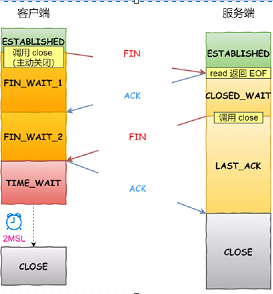

- 主动关闭链接的，进入`time_wait`状态
- 2MSL：`Maximum Segment Lifetime`，报文最大生存时间
  - **TTL**: IP数据报可以经过的最大路由数，每经过一个处理他的路由器此值就减1，当此值为0则数据报将被丢弃，同时发送`ICMP`报文通知源主机
  - **MSL**：MSL的单位是时间，而TTL是经过路由跳数。所以**MSL应该要大于等于TTL消耗为0的时间，以确保报文已被自然消亡**。
- TIME_WAIT作用：确保第四次挥手已经被对端收到
  - 因为不能确保第四次挥手是否能正确到达对端，因此等待2MSL，若没有到达，对端会**在2MSL内重传第三次挥手**
  - 防止具有**相同四元组**的旧数据包被收到；防止四元组被重用，老的数据包在新的四元组之间造成干扰； (五元组：四元组+序号)
  - 保证被动关闭连接的一方能被正确的关闭，即保证最后的ACK能让被动关闭方接收，从而帮助其正常关闭；保证正常关闭
- Linux 系统停留在TIME_WAIT的时间为固定的**60**秒, **MSL=30s**.
- time_wait过多
  - 说明是由服务器方主动发起的断开请求。
    - 内存资源占用
    - 端口资源的占用
  - 解决方法
    - 打开`net.ipv4.tcp_tw_reuse`和`net.ipv4.tcp_timestamps`选项；`net.ipv4.tcp_tw_reuse = 1，net.ipv4.tcp_timestamps=1`（默认即为 1）
      - net.ipv4.tcp_tw_reuse要慎用，因为使用了它就必然要打开时间戳的支持net.ipv4.tcp_timestamps，当客户端与服务端主机时间不同步时，客户端的发送的消息会被直接拒绝掉
    - `net.ipv4.tcp_max_tw_buckets`这个值默认为18000，当系统中**处于TIME_WAIT的连接一旦超过这个值**时，系统就会将所有的`TIME_WAIT`连接状态重置。
      - 这个方法过于暴力，而且治标不治本，带来的问题远比解决的问题多，不推荐使用。
    - 程序中使用`SO_LINGER`，**应用强制使用RST关闭**。TCP连接将跳过四次挥手，也就跳过了`TIME_WAIT`状态
- 常见问题：
  - 为什么time_wait要等待2MSL?
    - 保证最后的ACK能让被动关闭方接收，从而帮助其正常关闭；
    - 防止四元组被重用，老的数据包在新的四元组之间造成干扰； 


### 7.3 SYN攻击

- 发生在tcp连接过程中，三次握手只有前面一次，没有第三次ack，导致大量半链接，服务端大量syn_rcvd状态。
  - 许多tcp连接只发出第一次syn后，不发出ack，导致服务端很多链接出现syn_rcvd状态，从而服务器的syn队列满。

### 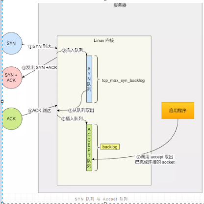

  - 如何检测 SYN 攻击？
    检测SYN攻击非常的方便，当你在服务器上看到大量的半连接状态时，特别是源IP地址是随机的，基本上可以断定这是一次SYN攻击。在Linux/Unix上可以使用系统自带的**netstats**命令来检测SYN攻击。
  - 解决方法：
    - 缩短超时（SYN Timeout）时间
    - 增加最大半连接数
    - 过滤网关防护
    - 利用**SYN Cookie**技术，在服务端接收到SYN后不立即分配连接资源，而是根据这个SYN计算出一个Cookie，连同第二次握手回复给客户端，在客户端回复ACK的时候带上这个Cookie值，服务端验证Cookie合法之后才分配连接资源。
      - 怎么设置？

- https://zhuanlan.zhihu.com/p/158970150
- https://zhuanlan.zhihu.com/p/388704023
- https://zhuanlan.zhihu.com/p/348276682


## 8. 其他

- 广播和多播不能用于 TCP
- TCP的性能经常为大家所诟病（跟keepAlive无关）
- 效率低：TCP+IP额外的header；建立连接需要三次握手，关闭连接需要四次挥手; 如果只是发送很少的数据，那么传输的有效数据是非常少的。
- 端口资源有限：如果连接一直不释放，端口资源有限。
- 常见问题：

  - 在浏览器键入网址，到网页显示，发生了什么?
    - https://mp.weixin.qq.com/s/iSZp41SRmh5b2bXIvzemIw
  - time_wait，close_wait过多怎么处理？ time_wait和close_wait可出现在那一端？
  - 对方服务器断电后，本端怎么处理？


# 二、UDP

- tcp 是一个面向**连接的**、**可靠的**、基于**字节流**的传输层协议

  - 连接：互相通信之前、需要三次握手建立连接

  - 可靠：序号、重传机制、流量控制、拥塞控制

- udp 是一个面向**无连接**、基于**报文**的传输层协议

# TCP和UDP的区别


# 工具

## 1. wireshark

- 下载目录：https://www.wireshark.org/download/win64/

  