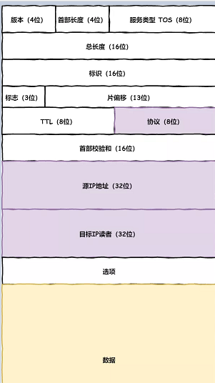

# IP

## 格式

- 版本
- 首部长度
- 服务类型
- 总长度
- 标识
- 标志
- 片偏移
- TTL
- 协议
- 首部校验和
- 源IP、目的IP
- 选项
- 数据

- 参考
  - [探究！一个数据包在网络中的心路历程](https://mp.weixin.qq.com/s/iSZp41SRmh5b2bXIvzemIw)

# ICMP

ICMP用于告知网络包传送过程中产生的错误以及各种控制信息。

---

- IP下面的网卡驱动程序负责控制网卡硬件，而最下面的网卡则负责完成实际的收发操作，也就是对网线中的信号执行发送和接收操作。
- 

