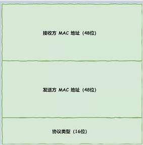

# MAC

### MAC

- MAC包头的协议类型通常使用：**0800：IP协议 ，0806：ARP协议**

- 发送方的MAC地址是在网卡生产时写入到ROM里的，接收方的MAC地址需要用目标IP根据**ARP协议**查到目标MAC。

- 所以先得搞清楚应该把包发给谁，这个只要查一下路由表就知道了。在路由表中找到相匹配的条目，然后把包发给 Gateway 列中的 IP 地址就可以了。

- ARP协议

  - 根据IP找到路由器的MAC地址。
  - 先**查询ARP缓存**，如果其中已经保存了对方的MAC地址，就不需要发送ARP查询，直接使用ARP缓存中的地址。而当ARP缓存中不存在对方MAC地址时，则发送**ARP广播查询**。(以太网所有的设备喊出：“这个IP地址是谁的？请把你的MAC地址告诉我”。然后就会有人回答：“这个IP地址是我的，我的MAC地址是 XXXX”。后续操作系统会把本次查询结果放到一块叫做ARP缓存的内存空间留着以后用，不过缓存的时间就几分钟)
  - `arp -a` 查询arp缓存    
  - 计算机的网卡本身具有MAC地址：并通过核对收到的包的接收方MAC地址判断是不是发给自己的，如果不是发给自己的则丢弃

- 交换机的ARP：交换机基于以太网设计的，俗称二层网络设备

  - **交换机的端口不具有MAC地址**：交换机的端口不核对接收方MAC地址，而是直接接收所有的包并将包的“**源MAC地址+进入交换机的端口**”存放到缓冲区中。将包存入缓冲区后，接下来需要查询一下这个包的接收方MAC地址是否已经在MAC地址表中有记录了。地址表中找不到指定的MAC地址。这可能是因为具有该地址的设备`还没有向交换机发送过包`，或者这个设备`有一段时间没有工作导致地址被从地址表中删除`了。这种情况下，交换机无法判断应该把包转发到哪个端口，只能将包**转发到除了源端口之外的所有端口上**，无论该设备连接在哪个端口上都能收到这个包   
  - 交换机的MAC地址表主要包含两个信息：一个是**设备的MAC地址**，另一个是该设备**连接在交换机的哪个端口上**.

- 路由器的ARP: 路由器是基于IP设计的，俗称三层网络设备

  - **路由器的各个端口都具有MAC地址和IP地址**
  - 路由器的端口具有 MAC 地址，因此它就能够成为以太网的发送方和接收方；同时还具有IP地址，从这个意义上来说，它和计算机的网卡是一样的。当转发包时，首先路由器端口会接收发给自己的以太网包，然后**路由表**查询转发目标，再由相应的端口作为发送方将以太网包发送出去。
  - 路由器也有ARP缓存，因此首先会在ARP缓存中查询，如果找不到则发送ARP查询请求。

- 参考

  

  - - [什么是MTU？为什么MTU值普遍都是1500？](https://developer.aliyun.com/article/222535)

  ---

  

# ARP

ARP[MAC层]用于根据IP地址查询相应的以太网MAC地址。